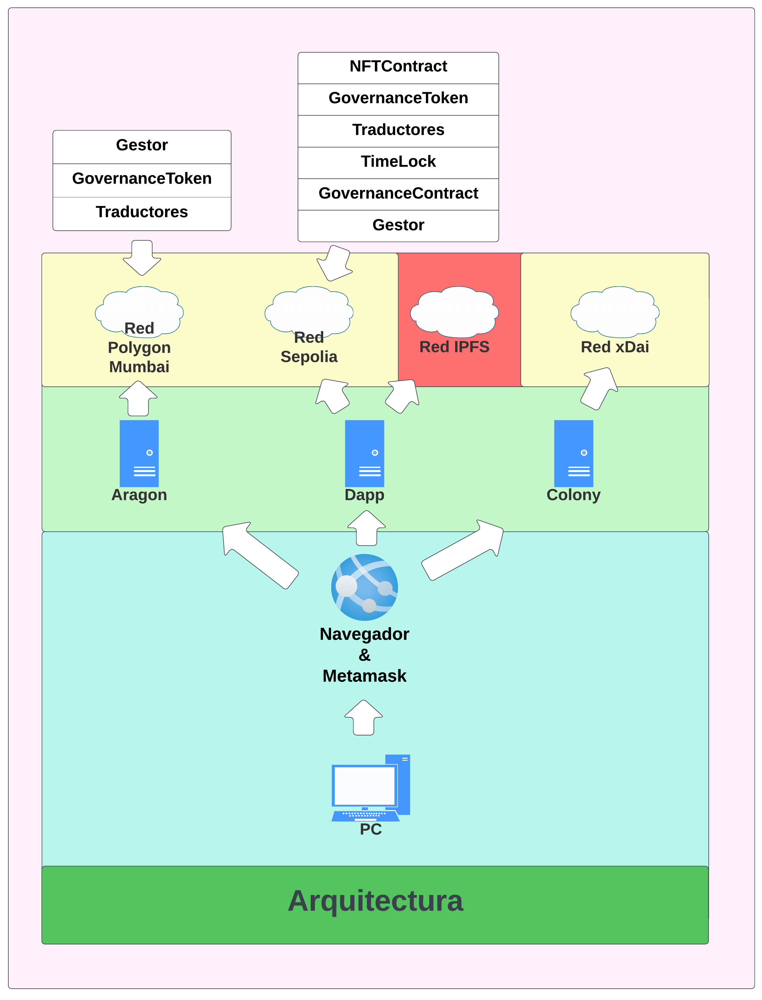
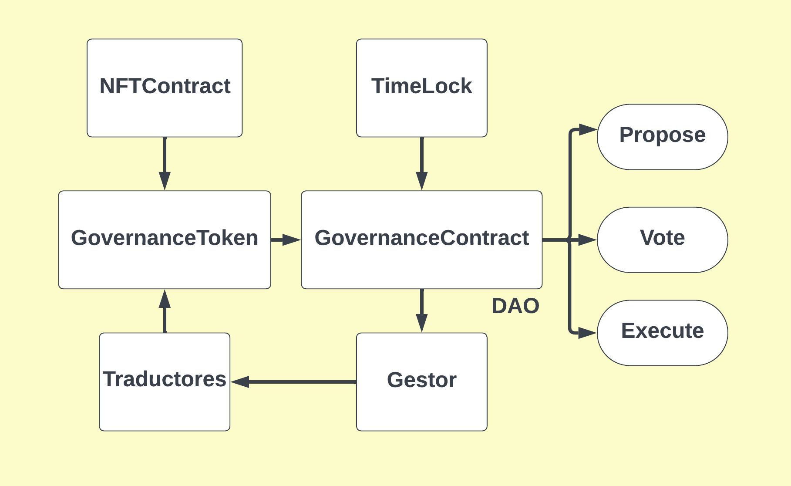

# Trabajo Fin de Master de Pablo Ruiz Giles


## Objetivos

Este proyecto se enfoca en la creación y aplicación de una Organización Autónoma Descentralizada (DAO) específicamente diseñada para el proyecto Smarterp. El objetivo principal es desarrollar una DAO altamente innovadora y personalizada que capitalice los beneficios de la descentralización y la participación democrática en la gestión de proyectos.


## Tabla de contenidos
- [Requisitos](#requisitos)
- [Instalación](#instalación)
- [Arquitectura física y lógica](#arquitectura-física-y-lógica)
- [Estructura de directorios](#estructura-de-directorios)
- [Interconexión de los contratos](#estructura-de-contratos)
- [Resumen](#resumen)
- [Contacto](#contacto)


## Requisitos

Los siguientes requisitos previos son necesarios para ejecutar el proyecto:

- **Tokens de la red Sepolia:** Se requieren tokens de la red Sepolia para interactuar con la DAO y los smart contracts.

- **Configuración de MetaMask:** Es esencial configurar MetaMask con la red de Sepolia para realizar transacciones de manera adecuada.

- **Nodo de IPFS en funcionamiento:** Debe contar con un nodo de IPFS operativo para la interacción con la red IPFS, utilizada para el almacenamiento de contenido digital.

- **Instalación de Truffle:** Se necesita la instalación de Truffle en el sistema para compilar, migrar y desplegar los smart contracts en la red de Sepolia.

- **React y Drizzle instalados:** La instalación de React y Drizzle es necesaria para desarrollar la interfaz web de la aplicación de la DAO y mejorar la experiencia del usuario.

- **NPM (Node Package Manager):** NPM es necesario para gestionar las dependencias del proyecto y facilitar la instalación de bibliotecas y paquetes durante el desarrollo.

- **Sistema Operativo Ubuntu 20.04:** El proyecto se desarrolló y probó en Ubuntu 20.04, por lo que se recomienda usar esta versión para garantizar la compatibilidad y evitar problemas de configuración.

- **Navegador web compatible:** Debe utilizar un navegador web compatible, como Google Chrome o Mozilla Firefox, para interactuar con las aplicaciones web y las interfaces de usuario de la DAO.

- **HDWalletProvider:** Este paquete es necesario para poder ejecutar los scripts con Truffle.

- **IPFS Companion:** Hay que tener habilitada la extensión para permitir una velocidad superior a la hora de la visualización de los NFT.

## Instalación

Para la instalación de este prototipo, únicamente será necesario seguir los siguientes pasos.

1. Clona el repositorio en tu máquina local:
```
git clone https://github.com/Pablo-Ruiz-Giles1/DAO.git
```

2. Navega al directorio raíz del proyecto:
```
cd DAO
```

Una vez dentro de la carpeta raíz, deberemos acceder a cada subcarpeta y ejecutar el siguiente comando:
```
npm install
```
Una vez instalado todos los paquetes, habrá qu instalar las siguientes extensiones en el navegador web
```
- Metamask
- IPFS Companion
```

Tras realazrlo, si se quiere arrancar la alpicación, habrá que irse a la carpeta de **IPFS** y ejecutar los siguientes comandos:
```
sudo sysctl -w net.core.rmem_max=2500000

npx ipfs daemon
```
Tras realizarlo, podrá ejecutar la Dapp, navegando a la carpeta dapp y ejecutando el comando:
```
npm start
```

### Arquitectura

A continuación, explicaremos la arquitectura del prototipo de la DAO. La representación de esta arquitectura se muestra en la Figura \ref{fig:Arquitectura de los prototipos}, y la hemos dividido en diferentes colores para destacar elementos específicos.

- **Azul:** Este color engloba los elementos necesarios para interactuar con nuestra Dapp y las aplicaciones web proporcionadas por Colony y Aragon. Para acceder a estas aplicaciones, se requiere un ordenador con un navegador web que tenga instalada una extensión de wallet. En este caso, utilizamos la extensión Metamask en las tres opciones para simplificar los casos.

- **Verde:** Aquí encontramos los servicios que proporcionan funcionalidad a la DAO. Esto incluye los servicios de Aragon y Colony, a los que se accede a través del navegador web. También tenemos nuestra propia Dapp, que se ejecuta localmente pero podría alojarse en servicios como Azure o AWS para estar en línea con las otras dos opciones.

- **Rojo:** Representa la red distribuida IPFS, que se encarga del almacenamiento y la visualización de los NFT creados mediante la Dapp y los smart contracts.

- **Amarillo:** Incluye las diferentes redes blockchain, tanto de capa 1 como de capa 2, utilizadas para los diversos servicios. En este caso, usamos Polygon Mumbai para Aragon, xDai para Colony y Sepolia para la Dapp.

- **Rosa:** Corresponde a los smart contracts desplegados en las distintas redes. Es importante destacar que, en el caso de Polygon Mumbai, los contratos relacionados con la parte de la DAO no se despliegan, ya que la propia aplicación web de Aragon se encarga de estas acciones.

Esta arquitectura proporciona una visión clara de cómo se interconectan los diferentes componentes para hacer funcionar la infraestructura de la DAO.





## Estructura de directorios


El proyecto está organizado en distintas carpetas para una mejor gestión y estructura. A continuación, se detalla la estructura de cada una de ellas:

### Truffle

La carpeta `Truffle` contiene todos los componentes necesarios para el desarrollo y despliegue de los smart contracts utilizados en la DAO. Su estructura interna incluye:

- `contracts`: Contiene archivos de smart contracts desarrollados en Solidity, cada uno en un archivo separado, implementando la lógica necesaria para la DAO.

- `migrations`: Contiene archivos de migración que definen el orden y la configuración para desplegar los smart contracts en la red.

- `scripts`: Contiene scripts de JavaScript que facilitan la interacción y pruebas con los smart contracts durante el desarrollo.

- `truffle-config.js`: Este archivo configura la interacción de Truffle con la red blockchain seleccionada, definiendo detalles como las redes disponibles y proveedores de red.

### IPFS

La carpeta `IPFS` contiene archivos necesarios para el funcionamiento del nodo de IPFS, obtenidos mediante la instalación de IPFS mediante npm, permitiendo la interacción con la red IPFS.

### Dapp

La carpeta `Dapp` alberga archivos generados en JavaScript para la creación de la interfaz web de la aplicación de la DAO. Su estructura interna se organiza en subcarpetas según la función de cada componente:

- `traductor`: Contiene componentes relacionados con la pestaña de traductor, permitiendo la interacción con los traductores.

- `roles`: Contiene componentes que identifican a los usuarios según sus roles, como traductores, compañías, administradores o usuarios no registrados.

- `home`: Contiene la página principal de la interfaz web, proporcionando una visión general y acceso a las diferentes secciones.

- `dao`: Contiene componentes que interactúan con la pestaña de la DAO, incluyendo funciones de gobernanza, votación y configuración.

- `ipfs`: Contiene componentes que interactúan con la pestaña de IPFS o NFT, permitiendo la creación y visualización de NFT creados en la DAO.

- `company`: Contiene componentes que interactúan con la pestaña de compañías, permitiendo la gestión y visualización de información relevante.


## Interconexión de los contratos

Los contratos inteligentes desarrollados en el proyecto, se interconectan para garantizar el correcto funcionamiento del proyecto:




- `TimeLock` está vinculado a `GovernanceContract`, que asume funciones ejecutivas de la DAO, permitiendo a individuos ejecutar acciones propuestas por la DAO.

- `GovernanceContract` se conecta con `Gestor`, facilitando acciones desde la DAO que impactan en el contrato `Traductores`.

- `GovernanceContract` también se relaciona con `GovernanceToken` para verificar y gestionar tokens de participación en la DAO.

- `GovernanceToken` se conecta tanto con `NFTContract` como con `Traductores`, administrando la asignación y eliminación de tokens y NFTs.


## Resumen

Este Trabajo de Fin de Máster (TFM) tiene como objetivo principal avanzar en la gestión de proyectos a través de la innovación en la estructura organizativa, aprovechando la tecnología blockchain y los principios de la DAO. Se busca mejorar la eficiencia y la participación democrática en el proyecto Smarterp mediante la implementación de una DAO a medida.


## Contacto

Este trabajo se ha realizado como proyecto de fin de máster de la Politécnica de Madrid por Pablo Ruiz Giles. Para más información ponerse en contacto a través de la cuenta de correo electrónico p.rgiles@alumnos.upm.es.
